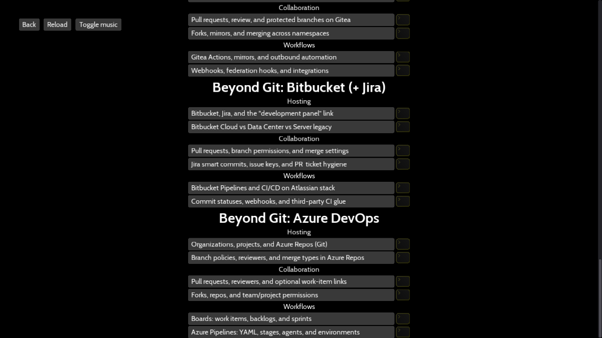

**Oh My Git!** is an open-source game about learning Git!

> **Unofficial fork.** This repository is a community-maintained fork of [Oh My Git!](https://github.com/git-learning-game/oh-my-git) by [blinry](https://github.com/blinry) and [bleeptrack](https://github.com/bleeptrack). Upstream home: [git-learning-game/oh-my-git](https://github.com/git-learning-game/oh-my-git).
>
> You are on the **`godot4`** branch (Godot **4.6**). The **`main`** branch is the same game and **Beyond Git** content on **Godot 3**. Questions or feedback about this fork: comment on [issue #237](https://github.com/git-learning-game/oh-my-git/issues/237).

### Branches

| Branch | Engine | Notes |
|--------|--------|--------|
| **`main`** | Godot 3.x | Original-style layout; play from source or [official itch.io builds](https://blinry.itch.io/oh-my-git) (Godot 3 only). |
| **`godot4`** | Godot 4.6 | Port of the game + Beyond Git; maintained here. |

## Play the game

This fork does **not** ship release binaries. Official downloads on [itch.io](https://blinry.itch.io/oh-my-git) are **Godot 3** builds from upstream—they will not run this branch.

To play the Godot 4 version:

1. Install [Godot 4.6](https://godotengine.org/download/archive/4.6-stable/) (or a compatible 4.6.x editor).
2. Clone this repo and check out the **`godot4`** branch: `git clone -b godot4 https://github.com/halfluke/oh-my-git.git` (or switch an existing clone with `git checkout godot4`).
3. Open **`project.godot`** in the editor and press **F5**, or from the repo root run `godot4 scenes/main.tscn` (use `godot` if that is your Godot 4 binary name).

To build your own export, install Godot 4 [export templates](https://docs.godotengine.org/en/stable/getting_started/workflow/export/exporting_projects.html) for your editor version (e.g. `4.6.stable`), plus `zip`, `wget`, and `7z`, then run `make` (override with `make GODOT=/path/to/godot` if needed).

## Beyond Git

In the **Play** level list, extra **Beyond Git** reading sections (GitHub, GitLab, Gitea, Bitbucket + Jira, Azure DevOps, and related platform theory) appear grouped at the bottom after the main Git tutorial chapters:



## What's extra in this fork

- **Godot 4.6.2** port on the `godot4` branch
- **Beyond Git** platform and theory chapters (same content themes as on `main`)
- **Freeroam** navigation with previous/next between levels
- **Reset progress** from the level menu

## Report bugs

- **This fork (Godot 4, Beyond Git, packaging):** add a comment on [upstream issue #237](https://github.com/git-learning-game/oh-my-git/issues/237).
- **Original Oh My Git! game:** use the [upstream issue tracker](https://github.com/git-learning-game/oh-my-git/issues).

Ideas for new features are welcome in the same places.

## Build your own level!

Wanna build your own level? Great! Here's how to do it:

1. Download [Godot **4.6**](https://godotengine.org/download/archive/4.6-stable/) (or a compatible 4.6.x release).
2. Clone this repository and check out the **`godot4`** branch.
3. Run the game—the easiest way is `godot4 scenes/main.tscn` from the project directory (or `godot` if that is your Godot 4 binary name).
4. Get a bit familiar with the levels which are currently there.
5. Take a look into the `levels` directory. It's split into chapters, and each level is a file.
6. Make a copy of an existing level or start writing your own. See the documentation of the format below.
7. Write and test your level. If you're happy with it, open a pull request on this fork—or, for changes that belong in the original game, consider upstream after discussing in [#237](https://github.com/git-learning-game/oh-my-git/issues/237).

### Level format

```
title = This is the level's title

[description]

This text will be shown when the level starts.

It describes the task or puzzle the player can solve.

[cli]

(optional) This text will be shown below the level description in a darker color.

It should give hints to the player about command line usage and also maybe some neat tricks.

[congrats]

This text will be shown after the player has solved the level.

Can contain additional information, or bonus exercises.

[setup]

# Bash commands that set up the initial state of the level. An initial
# `git init` is always done automatically. The default branch is called `main`.

echo You > people_who_are_awesome
git add .
git commit -m "Initial commit"

[win]

# Bash commands that check whether the level is solved. Write these as if you're
# writing the body of a Bash function. Make the function return 0 if it's
# solved, and a non-zero value otherwise. You can use `return`, and also, Bash
# functions return the exit code of the last statement, which sometimes allows
# very succinct checks. The comment above the win check will be shown in the game
# as win condition text.

# Check whether the file has at least two lines in the latest commit:
test "$(git show HEAD:people_who_are_awesome | wc -l)" -ge 2
```

A level can consist of multiple repositories. To have more than one, you can use sections like `[setup <name>]` and `[win <name>]`, where `<name>` is the name of the remote. The default name is "yours". All repositories will add each other as remotes. Refer to the [remote](levels/remotes) levels examples.

### Level guidelines

At this stage, we're still exploring ourselves which kind of levels would be fun! So feel free to try new things: basic introductions with a little story? Really hard puzzles? Levels where you have to find information? Levels where you need to fix a problem? Levels with three remotes?

## Contribute code!

To open the game in the [Godot editor](https://godotengine.org), run `godot4 project.godot`. You can then run the game using *F5*.

> **First-run note:** The `.import/` directory is gitignored. Open the project in the Godot 4 editor at least once before running from the command line, so assets (sounds, images, etc.) are imported correctly.

Upstream may still accept some pull requests, but day-to-day maintenance of the Godot 4 port happens on the **`godot4`** branch in this fork. Before large changes, say hello in [#237](https://github.com/git-learning-game/oh-my-git/issues/237).

Because merge conflicts in Godot scene files are painful, before editing an existing `*.tscn` file, please coordinate in [#237](https://github.com/git-learning-game/oh-my-git/issues/237).

To build binaries locally, see **Play the game** (export templates + `make`).

### Tests

Run `make test` with Godot 4.6 available on your PATH, or use the Docker-based test path documented in the Makefile if you prefer an isolated environment.

## Code of Conduct

We have a [Code of Conduct](CODE_OF_CONDUCT.md) in place that applies to all project contributions, including issues and pull requests.

## Funded by

<a href="https://www.bmbf.de/en/"></a>&nbsp; &nbsp; &nbsp; &nbsp; &nbsp; &nbsp; <a href="https://prototypefund.de/en/"></a>&nbsp; &nbsp; &nbsp; &nbsp; &nbsp; &nbsp; <a href="https://okfn.de/en/"></a>

## Thanks

- "success" sound by [Leszek_Szarzy, CC0](https://freesound.org/people/Leszek_Szary/sounds/171670/)
- "swish" sound by [jawbutch, CC0](https://freesound.org/people/jawbutch/sounds/344408/)
- "swoosh" sound by [WizardOZ, CC0](https://freesound.org/people/WizardOZ/sounds/419341/)
- "poof" sound by [Saviraz, CC0](https://freesound.org/people/Saviraz/sounds/512217/)
- "buzzer" sound by [Loyalty_Freak_Music, CC0](https://freesound.org/people/Loyalty_Freak_Music/sounds/407466/)
- "typewriter_ding" sound by [_stubb, CC0](https://freesound.org/people/_stubb/sounds/406243/)

## License

[Blue Oak Model License 1.0.0](LICENSE.md) – a [modern alternative](https://writing.kemitchell.com/2019/03/09/Deprecation-Notice.html) to the MIT license. It's a a pleasant read! :)
